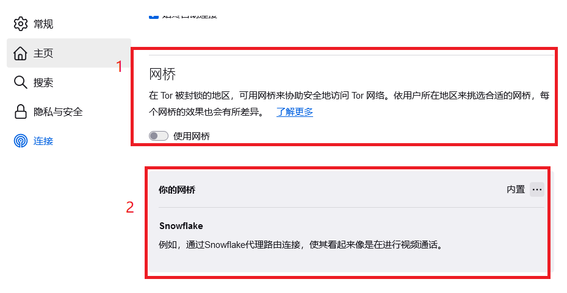
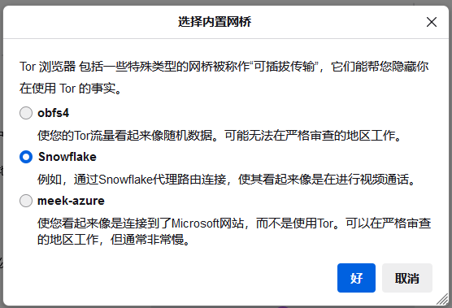

### Tor 浏览器基本使用流程【可用，快速连接tor网络】

#### 1. 下载 Tor 浏览器

- 前往 [Tor 浏览器官网](https://www.torproject.org/)
- 点击“Download”按钮，确保选择 Windows 版本。
- 下载完成后，找到安装文件（通常在“下载”文件夹中）。

#### 2. 安装 Tor 浏览器- 双击下载的安装文件（例如，`torbrowser-install-win64-x.x.x_xx.exe`）。

- 弹出安装向导窗口，选择语言（例如，中文），然后点击“OK”。
- 点击“浏览”选择安装目录（默认目录通常是可以的），然后“安装”- 安装完成后，点击“完成”按钮，启动 Tor 浏览器。

#### 3. 启动 Tor 浏览器

- 安装完成后，Tor 浏览器会自动启动，也可以通过桌面上的快捷方式启动。

- 第一次启动时，会弹出“Tor 网络设置”窗口。

  - 如果您的网络没有被封锁，选择“连接”。
  - 如果网络被封锁，选择“配置”以设置网桥或代理。

  在这个环节中，在被封锁的地区会受到限制。

  1. 我们需要找到设置，这个浏览器的布局和firefox很像。
  2. 在连接选项中，找到

​	然后删除默认网桥（如果有）即图2，随后在**添加网桥**标题下，点击**选择内置网桥**按钮。

​	随后选择 **Snowflake** 

 	回到新标签页并进行连接。

#### 4. 使用 Tor 浏览器

- 成功连接后，Tor 浏览器会打开一个新窗口，主页是 Tor 项目网站。
- 在地址栏输入你想访问的网站，然后按“回车”。
- 浏览器会通过 Tor 网络连接到网站，确保匿名性。

#### 5. 安全提示

- 尽量避免登录个人账户，以提高匿名性。
- 不要在 Tor 浏览器安装额外的浏览器扩展。
- 定期更新 Tor 浏览器，以获得最新的安全补丁。

#### 6. 关闭 Tor 浏览器

- 使用结束后，直接关闭浏览器窗口即可。
- 关闭时，Tor 浏览器会自动清除浏览历史。

TIP:

Snowflake 是一种新型的 Tor 网桥，旨在帮助用户绕过审查，特别是在网络受到限制的国家或地区。以下是关于flake 网桥的详细介绍：

### Snowflake 网桥概述

1. **什么是 Snowflake 网桥？** Snowflake 网桥是一种基于浏览器的代理服务，用户通过其他愿者的浏览器访问 Tor 网络。与传统的网桥不同，Snowflake 使用 WebRTC 技术，使其更难被检测和封锁。
2. **工作原理**
   - 当你使用 Snowflake 网时，你的流量会通过其他用户的器转发。这意味着你不直接连接到 Tor 网络，而是通过可用的 Snowflake 代理进行连接。每个 Snowflake 代理都是由志愿者提供的，因此可以增加网络的灵活性和可用性。
3. **使用场景**
   - Snowflake 特别适合在审查严格的环境中使用，例如某些国家地区限制访问 Tor 网络的情况下。它提供了一种快速且相对安全的访问方式。